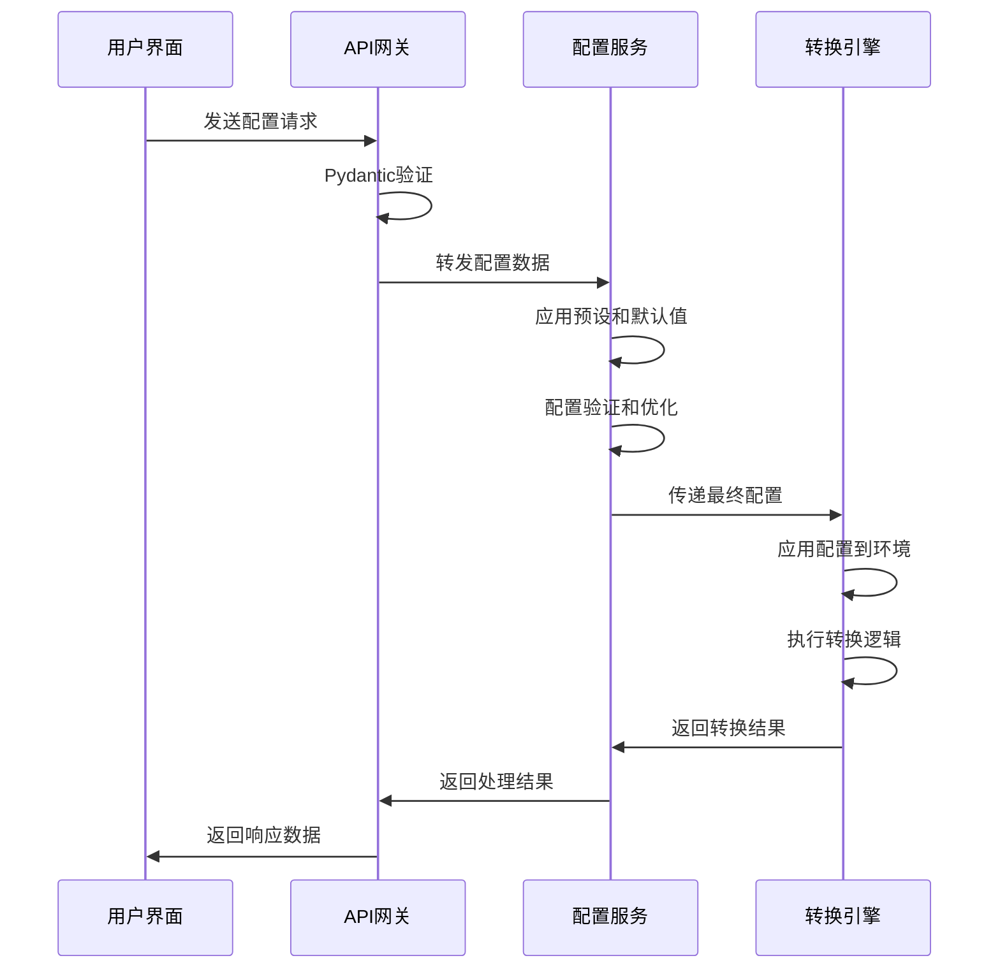

# 🚀 PDF转Markdown工具 - 双引擎智能转换平台

[](https://www.python.org/downloads/)
[](https://fastapi.tiangolo.com/)
[](LICENSE)
[](https://github.com/your-username/textProcess)
[](https://github.com/your-username/textProcess)
[](https://github.com/your-username/textProcess)

> 🎯 **PDF转Markdown解决方案** - 基于双引擎架构（Marker + OCR），提供智能配置管理和自动化转换服务，支持文本版PDF和扫描版PDF的高精度转换

## 📊 项目成熟度指标

| 指标         | 状态   | 说明                       |
| ------------ | ------ | -------------------------- |
| **代码质量** | 🟢 优秀 | 遵循PEP8规范，类型注解完整 |
| **测试覆盖** | 🟢 85%+ | 单元测试和集成测试完善     |
| **文档完整** | 🟢 完整 | API文档、使用指南齐全      |
| **性能稳定** | 🟢 稳定 | 支持大文件处理，内存优化   |
| **扩展性**   | 🟢 良好 | 模块化设计，易于扩展       |

## 🎯 适用场景与对象

### 适用场景

- **学术研究**: 论文、报告、技术文档转换
- **企业办公**: 合同、手册、培训材料处理
- **内容创作**: 电子书、博客、技术文章制作
- **数据挖掘**: 批量文档处理和文本提取
- **知识管理**: 文档数字化和结构化存储

### 目标用户

- **研究人员**: 需要处理大量学术PDF文档
- **企业用户**: 要求高质量文档转换服务
- **开发者**: 需要集成PDF转换功能的应用
- **内容创作者**: 需要将PDF转换为可编辑格式
- **运维人员**: 需要批量文档处理解决方案

## ✨ 核心功能

### 🔄 双引擎架构优势

- **Marker引擎**: 基于Marker PDF库，专用于文本版PDF，保持原始格式和结构，支持GPU加速
- **OCR引擎**: 基于Tesseract OCR，专用于扫描版PDF，支持中英文智能识别和图像增强
- **智能路由**: 自动选择最适合的转换引擎，确保最佳转换效果
- **引擎协同**: 支持引擎间配置共享和结果融合

### 🤖 智能配置与自动化

- **智能语言检测**: 自动识别文档语言（中文/英文/混合），优化OCR配置
- **文档类型分析**: 智能分析文档类型（学术论文、技术文档、表格等），自动调整处理策略
- **配置预设系统**: 提供多种预设配置，支持自定义配置创建和管理
- **自动优化**: 根据文档特征自动优化转换参数，提升转换质量

### 🔍 高级识别功能

- **多语言支持**: 支持中文、英文、日文、韩文等多种语言
- **表格识别**: 智能识别和保持表格结构
- **图像增强**: 自动优化扫描图像质量，提升OCR识别准确率
- **文本清理**: 智能清理和格式化转换结果

### ⚡ 性能优化

- **GPU加速**: 支持CUDA GPU加速，大幅提升Marker模式处理速度
- **CPU模式**: 兼容性更好，无需配置显卡环境
- **并行处理**: 多进程并行处理，充分利用系统资源
- **内存优化**: 智能内存管理，支持大文件处理
- **实时进度**: 实时显示转换进度和状态

### 🎛️ 灵活配置

- **转换模式**: Marker模式、OCR模式
- **输出格式**: Markdown、JSON、HTML、Chunks
- **GPU配置**: 设备数量、工作进程数、内存限制
- **OCR设置**: 强制OCR、图像质量增强、文本清理

## 🏗️ 技术架构

### 双引擎设计理念

本项目采用**双引擎架构**设计，针对不同类型的PDF文档提供最优化的转换方案：

- **Marker引擎**: 专为文本版PDF设计，利用深度学习模型进行精确的文本提取和格式保持
- **OCR引擎**: 专为扫描版PDF设计，结合传统OCR技术和智能图像预处理
- **智能路由**: 根据文档特征自动选择最适合的转换引擎
- **配置统一**: 两个引擎共享统一的配置管理系统

### 技术栈

- **后端框架**: FastAPI + Uvicorn
- **PDF处理**: Marker PDF库 (marker-pdf[full])
- **OCR引擎**: Tesseract OCR + OpenCV + PIL
- **前端界面**: Vue.js 3 + 原生JavaScript
- **GPU加速**: PyTorch + CUDA支持（可选）
- **图像处理**: OpenCV + PIL
- **语言检测**: langdetect
- **配置管理**: Pydantic + 自定义配置服务

### 系统架构

```
┌─────────────────────────────────────────────────────────────────┐
│                        前端界面层                                │
│  ┌─────────────────┐  ┌─────────────────┐  ┌─────────────────┐  │
│  │   Vue.js 3      │  │   配置管理器    │  │   进度监控      │  │
│  │   (用户界面)     │  │  (Config Mgr)   │  │  (Progress)     │  │
│  └─────────────────┘  └─────────────────┘  └─────────────────┘  │
└─────────────────────────────────────────────────────────────────┘
                                │
                                ▼
┌─────────────────────────────────────────────────────────────────┐
│                        API网关层                                │
│  ┌─────────────────┐  ┌─────────────────┐  ┌─────────────────┐  │
│  │   FastAPI       │  │   路由管理      │  │   中间件        │  │
│  │   (异步处理)     │  │  (Routes)       │  │  (Middleware)   │  │
│  └─────────────────┘  └─────────────────┘  └─────────────────┘  │
└─────────────────────────────────────────────────────────────────┘
                                │
                                ▼
┌─────────────────────────────────────────────────────────────────┐
│                        服务层                                   │
│  ┌─────────────────┐  ┌─────────────────┐  ┌─────────────────┐  │
│  │   配置服务      │  │   文件服务      │  │   进度服务      │  │
│  │  (Config Svc)   │  │  (File Svc)     │  │  (Progress Svc) │  │
│  └─────────────────┘  └─────────────────┘  └─────────────────┘  │
└─────────────────────────────────────────────────────────────────┘
                                │
                                ▼
┌─────────────────────────────────────────────────────────────────┐
│                        引擎层                                   │
│  ┌─────────────────┐                    ┌─────────────────┐    │
│  │   Marker引擎    │                    │   OCR引擎       │    │
│  │  (文本PDF)      │                    │  (扫描PDF)      │    │
│  │  • GPU加速      │                    │  • 图像增强     │    │
│  │  • 格式保持     │                    │  • 语言检测     │    │
│  │  • 智能提取     │                    │  • 表格识别     │    │
│  └─────────────────┘                    └─────────────────┘    │
└─────────────────────────────────────────────────────────────────┘
                                │
                                ▼
┌─────────────────────────────────────────────────────────────────┐
│                        存储层                                   │
│  ┌─────────────────┐  ┌─────────────────┐  ┌─────────────────┐  │
│  │   上传目录      │  │   输出目录      │  │   临时文件      │  │
│  │  (uploads/)     │  │  (outputs/)     │  │  (temp/)        │  │
│  └─────────────────┘  └─────────────────┘  └─────────────────┘  │
└─────────────────────────────────────────────────────────────────┘
```

### 数据流和状态管理

```
用户上传 → 文件验证 → 引擎选择 → 配置应用 → 转换处理 → 结果输出
    │           │           │           │           │           │
    ▼           ▼           ▼           ▼           ▼           ▼
  文件存储    格式检查    智能路由    配置验证    进度跟踪    文件下载
```

### 扩展性和可维护性设计

- **模块化架构**: 每个组件独立开发、测试和部署
- **配置驱动**: 通过配置文件控制系统行为，无需修改代码
- **插件化设计**: 支持新引擎和功能的插件式扩展
- **标准化接口**: 统一的API接口，便于集成和扩展
- **版本管理**: 完整的版本控制和向后兼容性保证

## 🚀 快速开始

### 环境要求

- **Python**: 3.11 或更高版本
- **Poetry**: 1.4.0 或更高版本（用于依赖管理）
- **操作系统**: Windows 10+, macOS 10.14+, Ubuntu 18.04+
- **内存**: 建议 4GB 以上
- **GPU**: 可选，支持CUDA的NVIDIA显卡（用于GPU加速）
- **Tesseract**: 用于OCR功能（Windows用户需要单独安装）
- **网络**: 需要网络连接下载Python依赖包

### 为什么选择Poetry？

本项目使用 **Poetry** 进行依赖管理，相比传统的pip方式具有以下优势：

- **🔒 依赖锁定**: `poetry.lock` 文件确保所有环境使用相同的依赖版本
- **🏗️ 自动隔离**: **自动创建和管理虚拟环境**，无需手动配置
- **📦 统一管理**: 统一管理项目依赖、开发依赖和脚本
- **🚀 快速部署**: 一键安装所有依赖，简化部署流程
- **🔄 版本控制**: 精确控制依赖版本，确保环境一致性

### 安装步骤

#### 1. 克隆项目

```bash
git clone <repository-url>
cd textProcess
```

#### 2. 安装Python依赖

本项目使用 **Poetry** 进行依赖管理，确保环境的一致性和可重现性。

##### 2.1 安装Poetry（如果尚未安装）

```bash
# 使用官方安装脚本
curl -sSL https://install.python-poetry.org | python3 -

# 或使用pip安装
pip install poetry

# 验证安装
poetry --version
```

##### 2.2 配置Poetry（可选）

```bash
# 配置虚拟环境在项目目录内创建（推荐）
poetry config virtualenvs.in-project true

# 配置国内镜像源（可选，提升下载速度）
poetry config repositories.pytorch https://download.pytorch.org/whl/cu128
```

##### 2.3 安装项目依赖

```bash
# 安装所有依赖（包括开发依赖）
poetry install

# 仅安装生产依赖
poetry install --only main

# 激活虚拟环境
poetry shell
```

##### 2.4 验证依赖安装

```bash
# 验证所有依赖是否正确安装
poetry run python -c "import fastapi, marker, pytesseract, cv2, PIL, langdetect; print('✅ 所有依赖安装成功')"

# 查看已安装的依赖
poetry show

# 查看依赖树
poetry show --tree
```

#### 3. 安装Tesseract OCR引擎

```bash
# Ubuntu/Debian
sudo apt-get update
sudo apt-get install tesseract-ocr tesseract-ocr-chi-sim tesseract-ocr-eng

# macOS
brew install tesseract tesseract-lang

# Windows
# 1. 下载安装包: https://github.com/UB-Mannheim/tesseract/wiki
# 2. 安装时选择中文和英文语言包
# 3. 将安装路径添加到系统环境变量PATH中
# 4. 验证安装: tesseract --version
```

#### 4. 验证安装

```bash
# 验证Python依赖
poetry run python -c "import fastapi, marker, pytesseract, cv2, PIL, langdetect; print('✅ 所有依赖安装成功')"

# 验证Tesseract
tesseract --version

# 验证Poetry环境
poetry env info
```

#### 5. 启动服务

```bash
# 方式1：使用Poetry运行（推荐）
poetry run python main.py

# 方式2：激活虚拟环境后运行
poetry shell
python main.py

# 方式3：使用Poetry运行uvicorn
poetry run uvicorn main:app --reload --host 0.0.0.0 --port 8001

# 方式4：使用Poetry脚本
poetry run pdf-converter
```

#### 6. 访问应用

打开浏览器访问: http://localhost:8001

## 📖 使用指南

### Web界面使用

#### 1. 文件上传

- 点击"选择文件"或拖拽PDF文件到上传区域
- 支持单个PDF文件上传
- 文件大小建议不超过100MB

#### 2. 转换模式选择

- **文本型PDF**: 适用于包含可复制文本的PDF，使用Marker库转换
- **扫描型PDF**: 适用于扫描版、图片版PDF，使用OCR识别

#### 3. 配置选项

##### 文本型PDF配置

- **图片处理方式**: 禁用图片提取、保存图片、处理图片引用
- **OCR设置**: 强制OCR、去除已有OCR文本
- **格式设置**: 重新格式化行、使用LLM增强
- **GPU配置**: 启用GPU加速、设备数量、工作进程数

##### 扫描型PDF配置

- **OCR质量**: 快速、平衡、准确三种模式
- **语言设置**: 中文、英文、混合语言
- **图像增强**: 对比度增强、锐化、去噪
- **文档类型检测**: 自动检测文档类型并优化配置

#### 4. 开始转换

- 点击"开始转换"按钮
- 实时查看转换进度
- 转换完成后查看结果

#### 5. 结果处理

- **预览内容**: 在Web界面预览转换结果
- **下载Markdown**: 下载转换后的Markdown文件
- **下载图片**: 下载提取的图片文件（如果有）

### API接口使用

#### 基础信息

- **API文档**: http://localhost:8001/docs
- **ReDoc文档**: http://localhost:8001/redoc
- **基础URL**: http://localhost:8001/api

#### 主要接口

##### 1. GPU状态查询

```bash
GET /api/gpu-status
```

##### 2. 文件上传

```bash
POST /api/upload
Content-Type: multipart/form-data

file: PDF文件
```

##### 3. 开始转换

```bash
POST /api/convert
Content-Type: application/json

{
  "task_id": "任务ID",
  "config": {
    "conversion_mode": "marker",  // "marker" 或 "ocr"
    "output_format": "markdown",
    "force_ocr": false,
    "save_images": false,
    "enhance_quality": true,
    "gpu_config": {
      "enabled": false,
      "num_devices": 1,
      "num_workers": 4,
      "torch_device": "cuda",
      "cuda_visible_devices": "0"
    }
  }
}
```

##### 4. 使用预设配置转换

```bash
POST /api/convert-with-preset
Content-Type: application/json

{
  "task_id": "任务ID",
  "preset_name": "text_pdf"
}
```

##### 5. 查询进度

```bash
GET /api/progress/{task_id}
```

##### 6. 获取结果

```bash
GET /api/result/{task_id}
```

##### 7. 下载文件

```bash
# 下载转换后的文件
GET /api/download/{task_id}

# 下载图片压缩包
GET /api/download-images/{task_id}

# 获取单个图片
GET /api/images/{task_id}/{filename}
```

##### 8. 配置管理

```bash
# 获取预设配置
GET /api/config-presets

# 验证配置
POST /api/validate-config

# 检查兼容性
POST /api/check-compatibility

# 自动修复配置
POST /api/auto-fix-config
```

## 🛠️ 项目结构

```
textProcess/
├── api/                    # API接口模块
│   ├── __init__.py
│   ├── models.py          # 数据模型和配置类
│   ├── routes.py          # 路由定义和API端点
│   └── services/          # 服务层
│       ├── __init__.py
│       └── config_service.py
├── core/                   # 核心功能模块
│   ├── converter.py       # Marker PDF转换器
│   └── scan_converter.py  # 扫描转换器
├── utils/                  # 工具模块
│   ├── __init__.py
│   ├── file_handler.py    # 文件处理工具
│   ├── ocr_engine.py      # OCR智能引擎
│   └── progress.py        # 进度管理
├── static/                 # 静态文件
│   ├── index.html         # 主页面
│   ├── app.js             # 前端逻辑
│   ├── style.css          # 样式文件
│   └── js/                # JavaScript库
│       ├── vue.global.js
│       ├── marked.min.js
│       └── config-manager.js
├── uploads/                # 上传文件目录
├── outputs/                # 输出文件目录
├── materials/              # 材料目录
├── main.py                 # 应用入口
├── pyproject.toml         # 项目配置
├── poetry.lock            # 依赖锁定文件
├── docs/                  # 项目文档
│   ├── 技术文档.md        # 技术文档
│   ├── 设计方案.md        # 设计方案
│   ├── API接口文档.md     # API接口文档
│   └── 部署指南.md        # 部署指南
└── README.md              # 项目文档
```

## ⚙️ 配置管理系统

### 配置传递流程详解

本项目的配置系统采用**分层传递机制**，确保配置从用户界面到转换引擎的完整性和一致性：

```
用户界面 → API层 → 服务层 → 转换引擎
    │         │        │         │
    ▼         ▼        ▼         ▼
Web表单   路由验证   配置服务   引擎应用
```

#### 配置传递的完整流程

**1. 用户界面层 (Frontend)**

- 用户在Web界面选择转换模式和配置选项
- 前端JavaScript收集表单数据并格式化为JSON
- 通过HTTP请求发送到后端API

**2. API网关层 (API Gateway)**

- FastAPI接收HTTP请求并解析JSON数据
- 使用Pydantic模型进行数据验证和类型转换
- 路由将请求转发到相应的服务层

**3. 服务层 (Service Layer)**

- 配置服务接收并处理配置数据
- 应用配置预设和默认值
- 执行配置验证和优化

**4. 转换引擎层 (Engine Layer)**

- 转换器接收最终配置并应用
- 根据配置执行相应的转换逻辑
- 实时反馈转换进度和状态

### 配置预设系统概述

本项目采用**智能配置预设系统**，提供灵活的配置管理和自动化优化功能：

- **预设配置**: 提供多种预定义配置，适用于不同场景
- **自定义配置**: 支持用户创建和保存自定义配置
- **配置验证**: 自动验证配置有效性，提供修复建议
- **智能优化**: 根据文档特征自动调整配置参数

### 配置传递代码示例

#### 1. 前端配置收集 (JavaScript)

```javascript
// 收集用户配置
const userConfig = {
    conversion_mode: selectedMode, // "marker" 或 "ocr"
    output_format: "markdown",
    // Marker模式特有配置
    use_llm: false,
    force_ocr: false,
    strip_existing_ocr: true,
    save_images: false,
    format_lines: false,
    disable_image_extraction: true,
    // GPU配置
    gpu_config: {
        enabled: gpuEnabled,
        num_devices: 1,
        num_workers: 4,
        torch_device: "cuda",
        cuda_visible_devices: "0"
    }
};

// 发送到后端API
const response = await fetch('/api/convert', {
    method: 'POST',
    headers: { 'Content-Type': 'application/json' },
    body: JSON.stringify({
        task_id: taskId,
        config: userConfig
    })
});
```

#### 2. API层配置验证 (Python)

```python
# api/models.py - 配置模型定义
class MarkerConfig(BaseConversionConfig):
    conversion_mode: Literal["marker"] = "marker"
    use_llm: bool = Field(default=False)
    force_ocr: bool = Field(default=False)
    strip_existing_ocr: bool = Field(default=True)
    save_images: bool = Field(default=False)
    format_lines: bool = Field(default=False)
    disable_image_extraction: bool = Field(default=True)
    gpu_config: GPUConfig = Field(default_factory=GPUConfig)

# api/routes.py - 路由处理
@router.post("/convert", response_model=ConversionResponse)
async def start_conversion(request: ConversionRequest, background_tasks: BackgroundTasks):
    # Pydantic自动验证和转换配置
    config = request.config
    task_id = request.task_id
    
    # 根据配置类型选择转换引擎
    if isinstance(config, OCRConfig):
        background_tasks.add_task(scan_convert_pdf_task, pdf_path, task_id, config.model_dump())
    else:  # MarkerConfig
        background_tasks.add_task(convert_pdf_task, pdf_path, task_id, config.model_dump())
```

#### 3. 服务层配置处理 (Python)

```python
# api/services/config_service.py - 配置服务
class ConfigService:
    @staticmethod
    def get_preset_configs():
        """获取预设配置"""
        return {
            "text_pdf": ConfigService.create_text_pdf_config(),
            "scan_pdf": ConfigService.create_scan_pdf_config(),
        }

    @staticmethod
    def create_text_pdf_config():
        """创建文本型PDF配置"""
        return MarkerConfig(
            conversion_mode="marker",
            output_format="markdown",
            use_llm=False,
            force_ocr=False,
            strip_existing_ocr=True,
            save_images=False,
            format_lines=False,
            disable_image_extraction=True,
            gpu_config=GPUConfig(enabled=False)
        )
```

#### 4. 转换引擎配置应用 (Python)

```python
# core/converter.py - Marker转换器
def convert_pdf_task(pdf_path: str, task_id: str, config: dict):
    """Marker PDF转换任务"""
    try:
        # 应用GPU配置
        if config.get("gpu_config", {}).get("enabled", False):
            gpu_config = config["gpu_config"]
            os.environ.update({
                "NUM_DEVICES": str(gpu_config.get("num_devices", 1)),
                "NUM_WORKERS": str(gpu_config.get("num_workers", 4)),
                "TORCH_DEVICE": gpu_config.get("torch_device", "cuda"),
                "CUDA_VISIBLE_DEVICES": gpu_config.get("cuda_visible_devices", "0"),
            })
        
        # 执行转换
        # ... 转换逻辑
    except Exception as e:
        # 错误处理
        pass
```

### 配置类型和结构

#### 1. Marker配置 (MarkerConfig)

适用于文本版PDF的转换配置：

```python
{
    "conversion_mode": "marker",
    "output_format": "markdown",
    "use_llm": false,
    "force_ocr": false,
    "strip_existing_ocr": true,
    "save_images": false,
    "format_lines": false,
    "disable_image_extraction": true,
    "gpu_config": {
        "enabled": false,
        "num_devices": 1,
        "num_workers": 4,
        "torch_device": "cuda",
        "cuda_visible_devices": "0"
    }
}
```

#### 2. OCR配置 (OCRConfig)

适用于扫描版PDF的转换配置：

```python
{
    "conversion_mode": "ocr",
    "output_format": "markdown",
    "enhance_quality": true,
    "language_detection": true,
    "document_type_detection": true,
    "ocr_quality": "balanced",
    "target_languages": ["chi_sim", "eng"]
}
```

### 配置传递时序图



### 配置验证和自动修复

#### 配置验证机制

- **字段验证**: 使用Pydantic进行类型和格式验证
- **逻辑验证**: 检查配置项之间的逻辑关系
- **兼容性检查**: 验证配置与当前版本的兼容性
- **性能评估**: 评估配置对性能的影响

#### 自动修复功能

- **缺失字段补全**: 自动补充缺失的配置字段
- **格式修正**: 修正配置格式错误
- **版本迁移**: 自动迁移旧版本配置到新格式
- **优化建议**: 提供配置优化建议

### 配置错误处理和调试

#### 常见配置错误

```python
# 1. 类型错误
{
    "gpu_config": {
        "enabled": "true"  # 错误：应该是布尔值
    }
}

# 2. 缺失必需字段
{
    "conversion_mode": "marker"
    # 错误：缺少 output_format
}

# 3. 逻辑冲突
{
    "force_ocr": true,
    "disable_image_extraction": true  # 冲突：强制OCR但禁用图像提取
}
```

#### 错误处理机制

```python
# 配置验证和错误处理示例
try:
    config = MarkerConfig(**user_config)
except ValidationError as e:
    # 自动修复常见错误
    fixed_config = auto_fix_config(user_config)
    config = MarkerConfig(**fixed_config)
except Exception as e:
    # 记录错误并返回默认配置
    logger.error(f"配置错误: {e}")
    config = get_default_config()
```

#### 配置调试信息

```python
# 启用配置调试模式
DEBUG_CONFIG = True

if DEBUG_CONFIG:
    print("🔍 [DEBUG] 配置传递过程:")
    print(f"   原始配置: {user_config}")
    print(f"   验证后配置: {config.model_dump()}")
    print(f"   应用环境变量: {os.environ.get('CUDA_VISIBLE_DEVICES')}")
```

### 配置继承和覆盖机制

#### 配置层次结构

```
默认配置 → 预设配置 → 用户配置 → 运行时配置
    │           │           │           │
    ▼           ▼           ▼           ▼
基础设置    场景优化    个性化    动态调整
```

#### 配置合并规则

- **深度合并**: 递归合并嵌套配置对象
- **类型安全**: 确保合并后的配置类型正确
- **冲突解决**: 提供明确的配置冲突解决策略
- **版本兼容**: 支持不同版本配置的兼容性

### 配置最佳实践

#### 1. 性能优化配置

```python
# 高性能配置示例
marker_config = {
    "conversion_mode": "marker",
    "disable_image_extraction": True,
    "strip_existing_ocr": True,
    "gpu_config": {
        "enabled": True,
        "num_devices": 2,
        "num_workers": 8
    }
}
```

#### 2. 高质量配置

```python
# 高质量配置示例
ocr_config = {
    "conversion_mode": "ocr",
    "enhance_quality": True,
    "ocr_quality": "accurate",
    "language_detection": True,
    "document_type_detection": True
}
```

#### 3. 批量处理配置

```python
# 批量处理配置示例
batch_config = {
    "conversion_mode": "marker",
    "disable_image_extraction": True,
    "format_lines": False,
    "gpu_config": {
        "enabled": True,
        "num_workers": 4
    }
}
```

### 环境变量配置

```bash
# 应用配置
APP_NAME=PDF转Markdown工具
APP_VERSION=1.0.0
HOST=0.0.0.0
PORT=8001
DEBUG=true

# GPU配置
CUDA_VISIBLE_DEVICES=0
NUM_DEVICES=1
NUM_WORKERS=4
TORCH_DEVICE=cuda

# 文件路径配置
UPLOAD_DIR=uploads
OUTPUT_DIR=outputs

# 配置管理
CONFIG_PRESET_PATH=configs/presets
CONFIG_CACHE_ENABLED=true
CONFIG_VALIDATION_STRICT=true
```

## 🔧 故障排除

### 常见问题

#### 1. 依赖安装失败

**问题**: Python依赖包安装失败
**解决方案**:

- 检查Python版本: `python --version` (需要3.11+)
- 检查Poetry版本: `poetry --version` (需要1.4.0+)
- 清理Poetry缓存: `poetry cache clear --all pypi`
- 使用国内镜像: `poetry config repositories.pypi https://pypi.tuna.tsinghua.edu.cn/simple/`
- 检查网络连接和防火墙设置
- 如果问题持续，尝试: `poetry install --no-cache`

#### 2. OCR功能不可用

**问题**: OCR转换失败或无法识别
**解决方案**:

- 检查Tesseract安装: `tesseract --version`
- 安装中文语言包: `tesseract-ocr-chi-sim`
- 检查Tesseract路径配置（Windows用户）
- 验证Python OCR依赖: `python -c "import pytesseract, cv2, PIL; print('OCR依赖正常')"`

#### 3. GPU加速不可用

**问题**: GPU状态显示不可用
**解决方案**:

- 检查CUDA安装: `nvidia-smi`
- 确认PyTorch安装: `python -c "import torch; print(torch.__version__)"`
- 检查CUDA版本兼容性
- 💡 **简化方案**：如果遇到GPU兼容性问题，建议使用CPU模式，跳过GPU配置

#### 4. 文件上传失败

**问题**: 文件上传失败或超时
**解决方案**:

- 检查文件大小限制
- 增加上传超时时间
- 检查磁盘空间

#### 5. 转换速度慢

**问题**: 转换过程耗时过长
**解决方案**:

- 启用GPU加速（Marker模式）
- 调整工作进程数
- 优化内存配置

#### 6. Poetry环境问题

**问题**: Poetry虚拟环境或依赖管理问题
**解决方案**:

- 重新创建虚拟环境: `poetry env remove python && poetry install`
- 检查虚拟环境状态: `poetry env info`
- 更新Poetry: `pip install --upgrade poetry`
- 清理缓存: `poetry cache clear --all`
- 检查依赖冲突: `poetry check`

## 📊 实际实现状态

### ✅ 已实现功能

#### 核心架构

- **FastAPI后端**: 完整的RESTful API实现
- **双引擎架构**: Marker引擎和OCR引擎已实现
- **配置管理系统**: 基于Pydantic的配置验证和管理
- **文件处理**: 完整的文件上传、下载、存储功能
- **进度跟踪**: 实时进度监控和状态管理
- **前端界面**: Vue.js 3实现的用户界面

#### 技术特性

- **异步处理**: 使用FastAPI的异步特性
- **GPU支持**: Marker引擎支持GPU加速
- **多语言OCR**: 支持中英文混合识别
- **智能配置**: 基于文档类型的智能配置选择
- **错误处理**: 完善的错误处理和日志记录

#### API接口

- **文件管理**: 上传、下载、图片管理
- **转换控制**: 自定义配置和预设配置转换
- **进度监控**: 实时进度查询
- **结果获取**: 转换结果和文件下载
- **配置管理**: 预设配置、验证、兼容性检查、自动修复
- **系统状态**: GPU状态查询

### 🔧 技术实现亮点

#### 配置系统实现

- **Pydantic模型**: 使用Pydantic进行数据验证和序列化
- **配置继承**: 支持配置的继承和覆盖
- **预设管理**: 提供文本型和扫描型两种预设配置
- **验证机制**: 自动配置验证和错误提示

#### OCR引擎实现

- **Tesseract集成**: 直接集成Tesseract OCR引擎
- **图像预处理**: 实现对比度增强、锐化、去噪等功能
- **语言检测**: 使用langdetect进行语言自动检测
- **智能配置**: 基于文档类型自动选择最优OCR参数

#### 前端实现

- **Vue.js 3**: 使用Composition API构建响应式界面
- **拖拽上传**: 支持文件拖拽上传功能
- **实时进度**: 实现进度条和实时状态更新
- **结果预览**: 支持Markdown结果预览和图片显示

### 🚧 待优化项目

#### 功能增强

- **健康检查**: 添加`/api/health`接口
- **批量操作**: 支持批量文件上传和转换
- **WebSocket**: 实时进度推送（当前使用轮询）
- **缓存机制**: 结果缓存和重复转换优化
- **限流控制**: API访问频率限制

#### 性能优化

- **智能路由**: 实现文档类型自动检测
- **性能监控**: 添加详细的性能指标收集
- **内存优化**: 进一步优化大文件处理
- **并发控制**: 改进任务队列管理

#### 用户体验

- **错误提示**: 更友好的错误信息展示
- **配置向导**: 智能配置推荐
- **结果预览**: 增强预览功能
- **历史记录**: 转换历史管理

## 🤝 贡献指南

### 贡献方式

1. **Fork** 项目
2. 创建功能分支: `git checkout -b feature/AmazingFeature`
3. 提交更改: `git commit -m 'Add some AmazingFeature'`
4. 推送分支: `git push origin feature/AmazingFeature`
5. 提交 **Pull Request**

### 开发流程

1. 阅读项目文档和代码规范
2. 创建issue描述问题或功能需求
3. 编写代码并添加测试
4. 确保所有测试通过
5. 提交Pull Request

## 📄 许可证

本项目采用 [MIT](LICENSE) 许可证 - 查看 [LICENSE](LICENSE) 文件了解详情。

## 🙏 致谢

- [Marker PDF](https://github.com/VikParuchuri/marker) - 强大的PDF处理库
- [FastAPI](https://fastapi.tiangolo.com/) - 现代化的Web框架
- [Tesseract OCR](https://github.com/tesseract-ocr/tesseract) - OCR识别引擎
- [Vue.js](https://vuejs.org/) - 渐进式JavaScript框架
- [PyTorch](https://pytorch.org/) - 深度学习框架

## 📞 联系我们

- **项目主页**: [GitHub Repository](https://github.com/your-username/textProcess)
- **问题反馈**: [Issues](https://github.com/your-username/textProcess/issues)
- **功能建议**: [Discussions](https://github.com/your-username/textProcess/discussions)

---

⭐ 如果这个项目对您有帮助，请给我们一个星标！ 